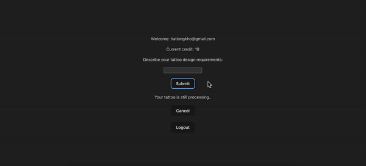

# **TattooScriptAI Application**

## **Introduction**

Welcome to TattooScriptAI, the innovative application transforming the way you conceptualize and design tattoos. At the heart of TattooScriptAI is a desire to blend creativity with technology, providing an intuitive platform where your words turn into art. Whether you're a tattoo enthusiast, an artist looking for inspiration, or just someone curious to see your ideas visualized, TattooScriptAI is tailored for you.

## **Frontend Development (Single Page Application)**

- **React**: Developed a responsive and interactive UI for the tattoo design process, implementing modern React patterns (Hooks, Context) for state management and lifecycle handling to ensure a seamless user experience.

## **Backend Services (Microservices Architecture)**

### **1. Login Service - Flask**

- **Objective**: Manage secure user authentication and authorization.
- **Features**:
    - Implements OAuth and JWT with Google for a streamlined login experience.
    - Ensures security and scalability in handling user credentials and sessions.

### **2. Input Service - Quarkus**

- **Objective**: Efficiently process and route user inputs.
- **Features**:
    - Utilizes WebSocket for real-time, bidirectional communication between clients and servers.
    - Leverages Kafka for reliable messaging and data handling across microservices.

### **3. AI Service - Spring Boot**

- **Objective**: Provide powerful, customized tattoo design generation.
- **Features**:
    - Integrates with Stability.ai's APIs for dynamic tattoo design creation.
    - Manages high-load scenarios with concurrent API handling and robust error management.

### **4. Kafka / Zookeeper**

- **Purpose**: Facilitate robust messaging and data streaming throughout the application's services.

## **Database (MySQL)**

- **Purpose**: Offer secure, efficient, and scalable storage for user data and application state.

## **Object Storage (AWS S3)**

- **Purpose**: Reliably host and serve user-generated designs with high availability and global access.

## **Containerization**

- **Docker**: Containerized all microservices to streamline development, testing, and deployment processes across diverse environments.

## **Getting Started**

**Kafka / Zookeeper**

- `docker-compose up -d`

**Login Service - Flask**

- `python3 app.py`

**Input Service - Quarkus**

- `quarkus dev`

**AI Service - Spring Boot**

- `./mvnw spring-boot:run`

**React**

- `npm run dev`

**MySQL**

- use MySQLWorkbench

**AWS S3**

- use AWS console